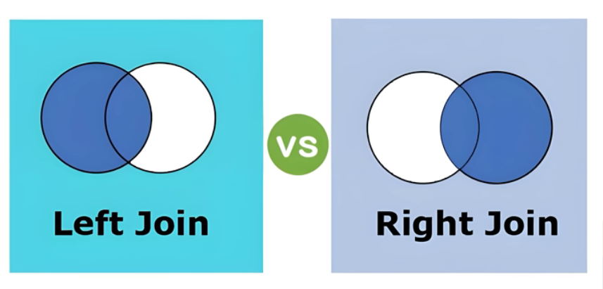
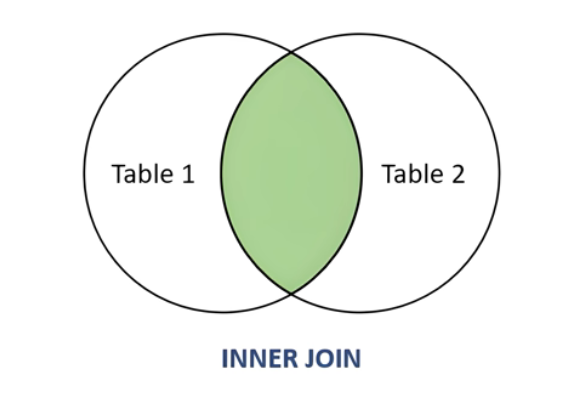

JOIN Type     Description

INNER JOIN - Only matching rows from both tables

LEFT JOIN - All rows from left table + matching from right

RIGHT JOIN - All rows from right table + matching from left

Operator Behavior

UNION - Combines results, removes duplicates

UNION ALL - Combines results, keeps duplicates

Self JOIN when you need to join a table with itself

